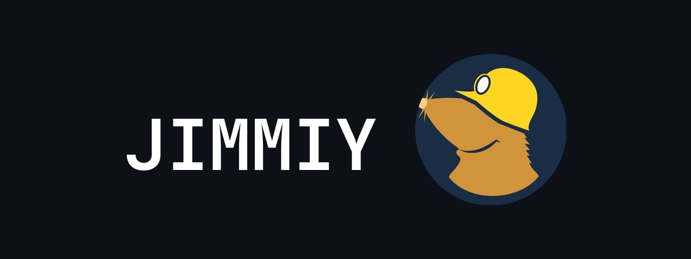
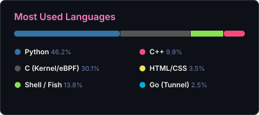

## Hey there! I'm Jimmiy 👋

> **15 y.o. Systems & Low-Latency Developer based in Uzbekistan**  
> *Passionate about Linux kernel internals, eBPF, network packet inspection, and zero-bloat engineering.*

---

  
  

---

 
  
  
  
  
  
  
  
  
  

 

 
  
  
  

 

---

### 🏆 Upstream Open-Source Contributions

- 🌟 **[wkentaro/gdown](https://github.com/wkentaro/gdown)** (5,500+ ⭐) — **Merged** ([PR #532](https://github.com/wkentaro/gdown/pull/532)) • Multiform RFC & raw URL resolution
- ⚡ **[secdev/scapy](https://github.com/secdev/scapy)** (11,500+ ⭐) — **PR Open** ([PR #5207](https://github.com/secdev/scapy/pull/5207)) • Fixed IPv6 Segment Routing Header crash

---

### 🐍 Contribution Activity

  <picture>
    <source media="(prefers-color-scheme: dark)" srcset="https://raw.githubusercontent.com/jimi18102010-commits/jimi18102010-commits/output/github-contribution-grid-snake-dark.svg">
    <source media="(prefers-color-scheme: light)" srcset="https://raw.githubusercontent.com/jimi18102010-commits/jimi18102010-commits/output/github-contribution-grid-snake.svg">
    
  </picture>

 

  

