<div align="center">


<br/>

<p align="center">
  <a href="https://xs338.xuss.us" target="_blank">
    
  </a>
  <a href="https://t.me/jimmiy_dev" target="_blank">
    
  </a>
  <a href="https://x.com/jimmiy_dev" target="_blank">
    
  </a>
</p>



</div>

---

### ⚡ Systems Architecture & Engineering

```text
┌──────────────────┬──────────────────────────────────┬─────────────────────────────┬─────────────┐
│ Project / Work   │ Low-Level Tech Stack             │ Benchmark & Capabilities    │ Status      │
├──────────────────┼──────────────────────────────────┼─────────────────────────────┼─────────────┤
│ ⚡ VORTEX        │ eBPF / XDP, C, Python 3.12       │ 12.4M PPS wire drops O(1)   │ Active 🚀   │
│ 🎯 secdev/scapy  │ Core IPv6 & SRH Header Engine    │ Fixed IndexError (#5206)    │ PR #5207 ⚡ │
│ 📦 wkentaro/gdown │ Multi-stream Chunk Parser        │ Upstream RFC URL resolution │ Merged ✅   │
│ 👁️ FaceBlast     │ PyTorch, ArcFace, ONNX, Qt6      │ <18ms real-time inference   │ Production  │
│ 🚀 DriveBlast    │ Async Chunk Streaming Pool       │ 98 MB/s wire saturation     │ Production  │
└──────────────────┴──────────────────────────────────┴─────────────────────────────┴─────────────┘
```

---

- 15 y.o. systems & low-latency software developer based in Uzbekistan
- focus on low-latency systems, kernel filters (eBPF/XDP), networking protocols, and zero-bloat CLI tooling
- upstream contributor to [wkentaro/gdown](https://github.com/wkentaro/gdown) (PR #532) & [secdev/scapy](https://github.com/secdev/scapy) (PR #5207)
- building [VORTEX](https://github.com/jimi18102010-commits/vortex) (eBPF/XDP Anti-DDoS Shield & TLS Radar), [FaceBlast](https://github.com/jimi18102010-commits/faceblast) & [DriveBlast](https://github.com/jimi18102010-commits/Driveblast)
- site: [xs338.xuss.us](https://xs338.xuss.us)

---

<br/>

<p align="center">
  
  
  
  
  
  
  
  
</p>

<br/>

---

<div align="center">

<h2>Visitor Count:</h2>


</div>
