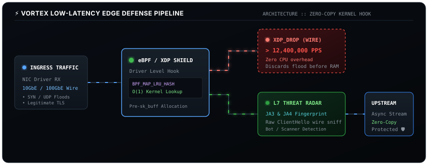

 

  
  
  

<!-- Vector Terminal Card -->

  

<!-- Real-time Packet Flow Architecture -->

---

### 🥷 Profile & Focus
- 15 y.o. software & systems engineer based in Uzbekistan
- focus on low-latency systems, kernel filters (eBPF/XDP), networking protocols, and zero-bloat CLI tooling
- upstream contributor to [wkentaro/gdown](https://github.com/wkentaro/gdown) (PR #532) & [secdev/scapy](https://github.com/secdev/scapy) (PR #5207)
- author of [VORTEX](https://github.com/jimi18102010-commits/vortex) (eBPF/XDP Anti-DDoS Shield & TLS JA4 Radar), [FaceBlast](https://github.com/jimi18102010-commits/faceblast) & [DriveBlast](https://github.com/jimi18102010-commits/Driveblast)

---

### 🛠️ Core Systems Stack

  
  
  
  
  
  
  
  

---

### 🐍 Contribution Activity

  <picture>
    <source media="(prefers-color-scheme: dark)" srcset="https://raw.githubusercontent.com/jimi18102010-commits/jimi18102010-commits/output/github-contribution-grid-snake-dark.svg">
    <source media="(prefers-color-scheme: light)" srcset="https://raw.githubusercontent.com/jimi18102010-commits/jimi18102010-commits/output/github-contribution-grid-snake.svg">
    
  </picture>

 

  

